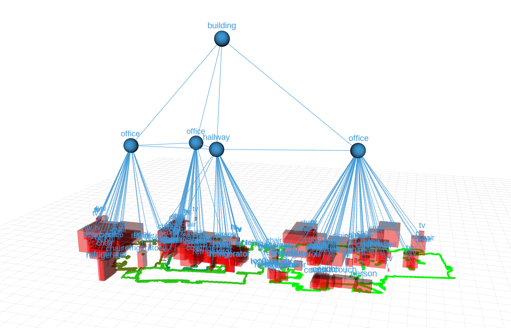

#  Original Repository at https://github.com/sijanz/scene_graph_room_classification 

# A ROS Package for the Creation of a 3D Scene Graphs Utilizing Room Classification



## Description
This ROS package enables the creation of a hierarchical 3D scene graph during runtime using Vision Language Models (VLMs) for enhanced object detection and relationship extraction. In contrast to other solutions, rooms are segmented, classified and added as nodes as well.
A robot using this package has to be equipped with a camera that provides an RGB stream and a depth stream. Optimally, the robot is equipped with a 360° laser scanner.
The package generates a 3D scene graph and comes with tools to visualize it using RViz.


## System Architecture

### VLM Service Module (`vlm_service_node.py`)
Provides Vision Language Model inference as a ROS service. Supports multiple backends: Florence-2, vLLM, and external APIs (Google Gemini).

#### Service
- `/vlm_inference` using `scene_graph/VLMInference` service

#### Publishers
- Object relationships: `/scene_graph/object_relationships` using `std_msgs/String` messages

#### Parameters
- `~backend`: VLM backend to use (`florence`, `vLLM`, or `external`)
- `~external_url`: URL for external VLM API (default: `http://localhost:8002/v1`)
- `~external_model`: Model name for external API (default: `gemini-2.5-flash-lite`)
- `~florence_url`: URL for Florence server (default: `http://florence:8001`)
- `~vlm_url`: URL for vLLM server (default: `http://localhost:8002/v1/chat/completions`)
- `~external_rate_limit`: Rate limit for external API in seconds (default: 4.0)

### Visual Interface Module (`visual_interface_base.py`)
Processes synchronized camera streams and calls VLM service to detect objects with 2D bounding boxes, then transforms them to 3D world coordinates using depth information and camera transforms.

#### Subscribers
- RGB input stream: `/camera/color/image_raw` using `sensor_msgs/Image` messages
- Depth input stream: `/camera/depth/points` using `sensor_msgs/PointCloud2` messages
- Odometry input: `/odom` using `nav_msgs/Odometry` messages
- Camera intrinsics: `/camera/color/camera_info` using `sensor_msgs/CameraInfo` messages

#### Publishers
- 3D bounding boxes of detected objects: `/scene_graph/seen_graph_objects` using `scene_graph/GraphObjects` messages

#### Service Clients
- VLM inference: `/vlm_inference` using `scene_graph/VLMInference` service

### Graph Management Module (`graph_management_node.py`)
Iteratively generates a 3D scene graph at runtime. Manages object nodes, room nodes, and building nodes in a hierarchical graph structure. Publishes visualization markers for RViz.

#### Subscribers
- 3D bounding boxes of seen objects: `/scene_graph/seen_graph_objects` using `scene_graph/GraphObjects` messages
- Polygons of segmented rooms: `/scene_graph/rooms` using `scene_graph/RoomPolygonList` messages
- Label of classified room: `/scene_graph/classified_room` using `scene_graph/ClassifiedRoom` messages
- Control signals: `/scene_graph/control` using `std_msgs/Bool` messages
- Object relationships: `/scene_graph/object_relationships` using `std_msgs/String` messages

#### Publishers
- Objects in the graph: `/scene_graph/graph_objects` using `scene_graph/GraphObjects` messages
- Objects in a given room to be classified: `/scene/graph/room_with_objects` using `scene_graph/RoomWithObjects` messages
- Visualization of object bounding boxes: `/scene_graph/viz/object_bbox_marker` using `visualization_msgs/MarkerArray` messages
- Visualization of room nodes: `/scene_graph/viz/room_markers` using `visualization_msgs/MarkerArray` messages
- Visualization of building nodes: `/scene_graph/viz/building_markers` using `visualization_msgs/MarkerArray` messages
- Visualization of edges: `/scene_graph/viz/line_markers` using `visualization_msgs/MarkerArray` messages
- Visualization of node labels: `/scene_graph/viz/text_markers` using `visualization_msgs/MarkerArray` messages
- Visualization of relationships: `/scene_graph/viz/relationship_markers` using `visualization_msgs/MarkerArray` messages
- Debug bbox points: `/scene_graph/debug/bbox_points` using `visualization_msgs/MarkerArray` messages

### Room Segmentation Module
Uses the IPA room segmentation package to segment floor plans into individual rooms.

#### Service Server
- Room segmentation: Provided by `ipa_room_segmentation` package

#### Publishers
- Room polygons: `/scene_graph/rooms` using `scene_graph/RoomPolygonList` messages

## Prerequisites

- ROS Noetic on Ubuntu 20.04 LTS
- Camera that provides RGB and depth streams (e.g. Orbbec Astra, Intel RealSense)
- High-FOV laser scanner (optional, for room segmentation)
- Robot compatible with ROS with proper TF tree configuration
- VLM backend service running (Florence-2, vLLM, or Google Gemini API)

## Installation
Install the [CGAL](https://www.cgal.org/) library for room segmentation, then clone and build this package:
```bash
sudo apt-get install libcgal-dev ros-noetic-image-geometry
cd <your_catkin_workspace>/src
git clone https://github.com/Kazgatari/scene_graph_room_classification_bachelor
cd .. && catkin_make
```

## Configuration

### Camera Setup
Ensure your camera publishes the following topics:
- `/camera/color/image_raw` - RGB images
- `/camera/depth/points` - Depth point cloud
- `/camera/color/camera_info` - Camera intrinsics
- `/odom` - Robot odometry

### VLM Backend Setup
The system requires a VLM service. You can use:

1. **External API (Google Gemini)**: Start the containerized API server at `http://localhost:8002/v1`
2. **Florence-2**: Start the Florence container at `http://florence:8001`
3. **vLLM**: Start a vLLM server at `http://localhost:8002/v1/chat/completions`

## Usage

### Quick Start with Launch File
Launch the entire pipeline with a single command:
```bash
roslaunch scene_graph full_pipeline.launch
```

This launch file starts:
- VLM service node with external backend (Google Gemini)
- Visual interface node for object detection and localization
- Graph management node for scene graph generation
- RViz for visualization
- Room segmentation server and client

### Manual Start (Individual Nodes)
Alternatively, run nodes individually in separate terminals:

```bash
# Start VLM service
rosrun scene_graph vlm_service_node.py _backend:=external _external_url:=http://localhost:8002/v1
```

```bash
# Start visual interface for object detection and 3D localization
rosrun scene_graph visual_interface_base.py
```

```bash
# Start graph management node
rosrun scene_graph graph_management_node.py
```

```bash
# Start RViz for visualization
rosrun rviz rviz
```

```bash
# Start room segmentation (optional)
rosrun ipa_room_segmentation room_segmentation_server
rosrun ipa_room_segmentation room_segmentation_client_graph
```

## Visualization
The scene graph can be visualized in RViz by subscribing to the following topics:
- `/scene_graph/viz/object_bbox_marker` - Object bounding boxes
- `/scene_graph/viz/room_markers` - Room nodes
- `/scene_graph/viz/building_markers` - Building nodes
- `/scene_graph/viz/line_markers` - Graph edges
- `/scene_graph/viz/text_markers` - Node labels
- `/scene_graph/viz/relationship_markers` - Object relationships
